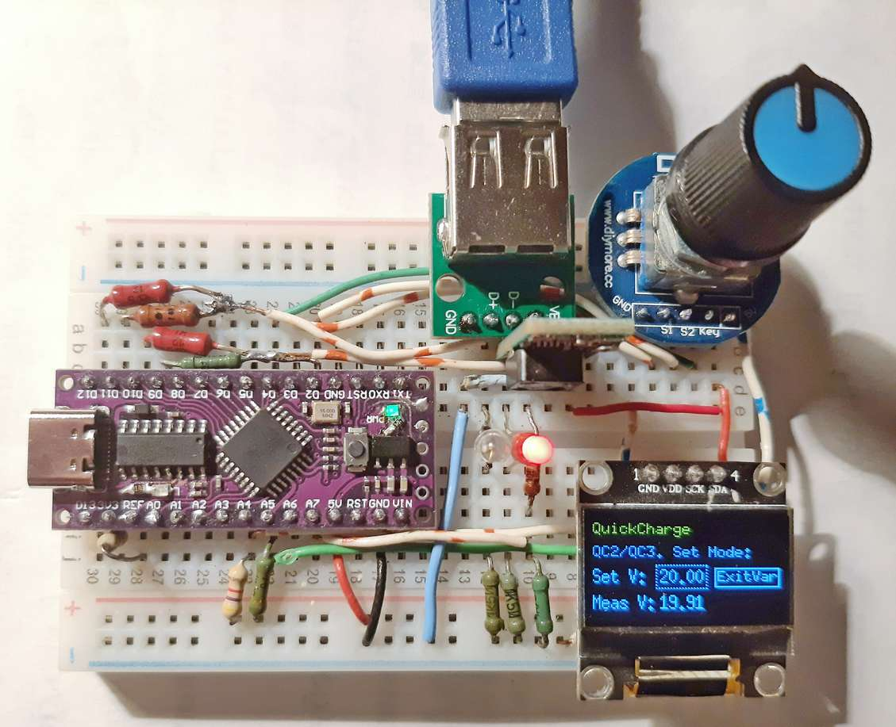
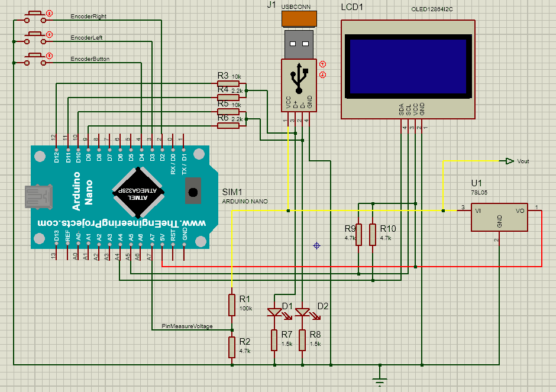

# QuickCharge trigger

Сделано на базе библиотеки [QuickCharge](https://github.com/GyverLibs/QuickCharge) от Egor 'Nich1con' Zakharov & AlexGyver. 

Добавлено отображение на экранчике режимов QuickCharge и выбор с помощью энкодера. Также выводится измеренное напряжежение.

Собрано на мекетной плате:

Эл. схема:

 

Светодиоды с резисторами использованы вместо стабилитронов. 

Вместо 78l05 позже был использован миниатюрный модуль DC-DC преобразователя с выставленным напряжением 3,3В. В таком случае в режиме QC3.0 можно не только поднимать напряжение до 20В, но и опускать до 3,6В (у 78l05 слишком большое падение).

Для работы с OLED-экранчиком была ипрользована и модифицирована библиотека u8g2 от olikraus. Модифицированная версия, которая может рисовать пунктирные линии/рамки [здесь](https://github.com/GeorgeBobrov/U8g2).

**Enjoy!**
