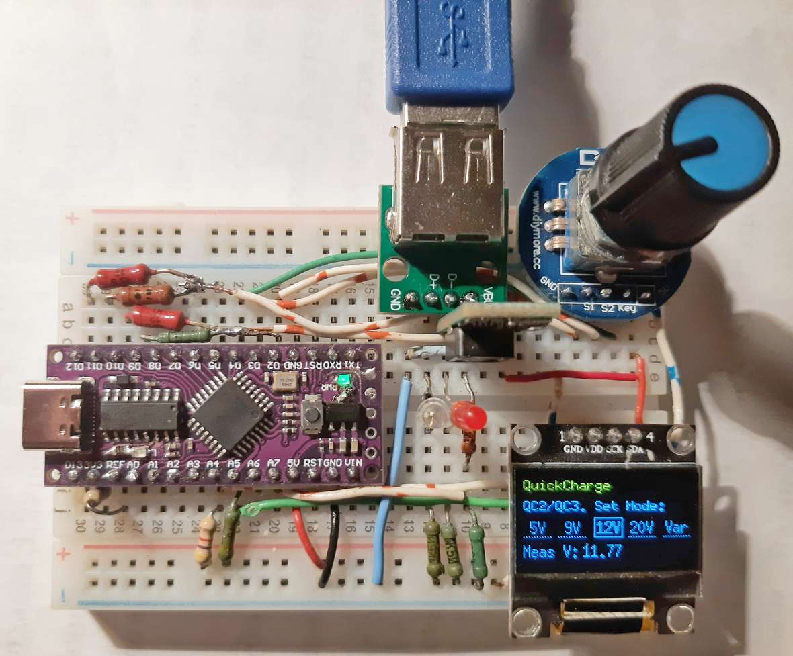

# QuickCharge trigger

Сделано на базе библиотеки [QuickCharge](https://github.com/GyverLibs/QuickCharge) от Egor 'Nich1con' Zakharov & AlexGyver. Эл. схема есть там же. 

Добавлено отображение на экранчике режимов QuickCharge и выбор с помощью энкодера. Также выводится измеренное напряжежение.

Собрано на мекетной плате:

Для работы с OLED-экранчиком была ипрользована и модифицирована библиотека u8g2 от olikraus. Модифицированная версия, которая может рисовать пунктирные линии/рамки [здесь](https://github.com/GeorgeBobrov/U8g2).

**Enjoy!**
